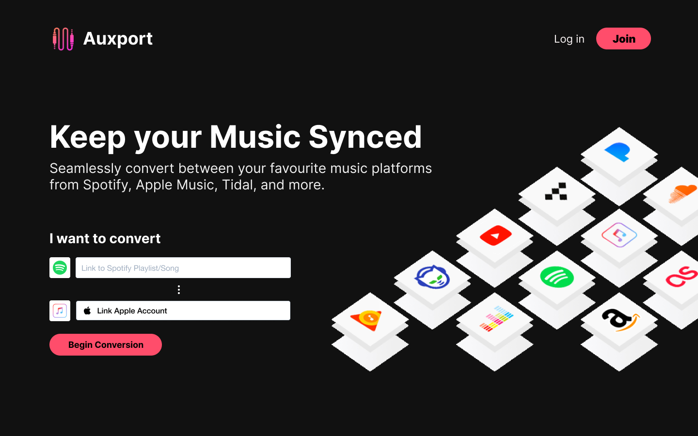

  

  <h1>Auxport</h1>

Auxport is a playlist converter between music platforms. It support seamless conversion with real-time syncing between popular services such as Spotify, Google Play Music, YouTube, Tidal, and Apple Music.

# Features

- **10+ Integrations** - Auxport supports all popular music streaming services and seamlessly converts your music between different platforms. Never worry about manually exporting between services again!
- **Live Sync** - Whenever a playlist is updated on one service, Auxport will automatically convert that playlist to your other platforms as well. Premium is required to use this feature.
- **Simple, intuitive UI** - Auxport is a web app that anyone can use from anywhere at anytime. This means no more desktop downloads and viruses!

# Disclaimer

This repository is used for demo purposes. Sensitive parts of the code have been removed.